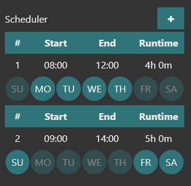
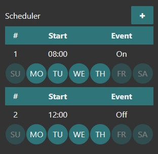
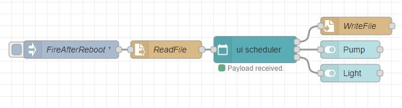
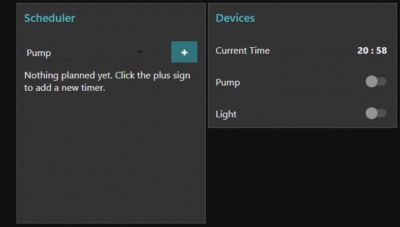

# node-red-contrib-ui-time-scheduler
A node-red-ui time scheduler for the Node-RED Dashboard.  

|  |  |
| :----------------------------: | :-------------------------------: |
|         *Default Mode*         |           *Event Mode*            |

## Install
  
You can install this node directly from the "Manage Palette" menu in the Node-RED interface.  
Alternatively, run the following command in your Node-RED user directory - typically `~/.node-red` on Linux or `%HOMEPATH%\.nodered` on Windows

        npm install node-red-contrib-ui-time-scheduler

### Requirements ###
node-red v0.19 or above  
node-red-dashboard v2.10.0 (v2.15.4 or above would be ideal)
  
## Usage
  
Add a time-scheduler-node to your flow. Open the dashboard, you will see an empty scheduler.
Click the plus sign at the top right corner of the node to create a new timer.
  
### Input
  
You can inject timers via a msg property `payload` (see [restoring schedules after a reboot](#Restoring-schedules-after-a-reboot) section). If the injected msg has a property `disableDevice` or `enableDevice` the node will disable/enable the devices output. Disabling/enabling works both with device name and index.
  
### Output
  
Whenever you add, edit or delete a timer a JSON string is sent to the nodes top output. This JSON string contains all timers and settings.

Every other output (number of total outputs depends on how many devices you have added) emits true/false every 60 seconds. In Event Mode the event is only sent at the specified time. Adjusting the refresh rate, choosing if a msg.`topic` is sent and if messages are blocked unless the value has changed is possible within the node's options.

### Restoring schedules after a reboot
  
You can use the JSON string from the nodes top output to directly inject timers after a (re)boot or (re)deploy:
  

  
If you changed the node-red <a target="blank" href="https://nodered.org/docs/user-guide/context#context-stores">contextStorage to localfilesystem</a>, timers are automatically saved and restored after a reboot.
  
### Frontend & Demo
  
 |
:--: |
*Time Scheduler Demo (Default Mode)* |

## Examples
  
You can find example flows and schedules within the examples folder.
Easily import flows via the Node-RED flow editor:
  
☰ -> Import -> Examples -> node-red-contrib-ui-time-scheduler
  
## History
  
Find the changelog [here](CHANGELOG.md).
  
# Donate
  
You can donate by clicking the following link if you want to support this free project:
  

